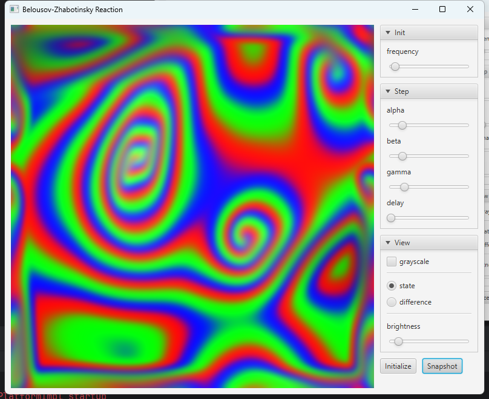

# A cellular automaton for the Belousov-Zhabotinsky reaction

- A chemical oscillator with chaotic behavior. Its evolution depends on 
  three parameters (alpha, beta, gamma) that can be used to create a large 
  variety of shapes.

- The state arrays can be initialized at any time with simplex noise of
  a chosen frequency. In my opinion the most interesting shapes arise 
  short after initialization.

- The reaction can be watched by looking either at the sequence of states 
  or the sequence of state differences.

- The app is written in Kotlin and uses JavaFX for the user interface.

